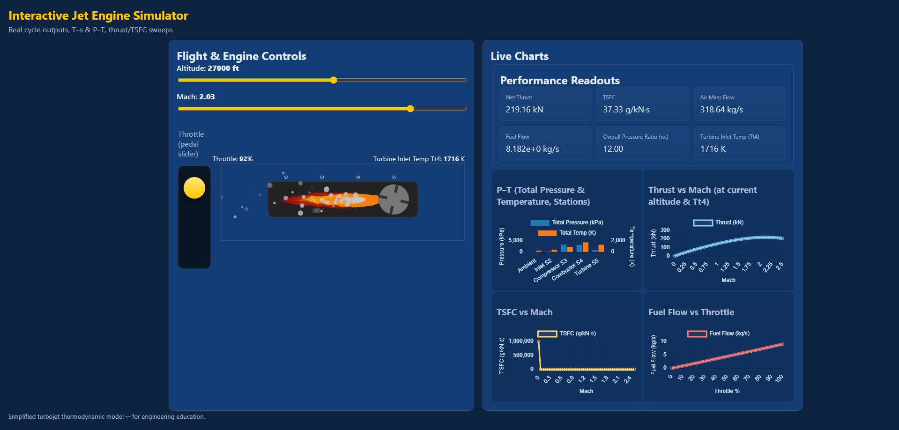

# Interactive Jet Engine Simulator

This project is a web-based application that provides an interactive simulation of a single-spool turbojet engine. It's built with vanilla JavaScript and uses a thermodynamic model to calculate and display engine performance in real-time. The interface allows you to adjust flight conditions (altitude, Mach) and throttle to see how they impact thrust, fuel consumption, and the engine's internal state, all visualized with dynamic charts and animations.

**[\>\> View the Live Demo\! \<\<](https://jesse-flores.github.io/Jesse-EE-CS.github.io/jet-engine-simulator.html)**


-----

## Features

  - **Interactive Controls:** Adjust altitude, Mach number, and throttle in real-time.
  - **Dynamic Engine Visualization:** An animated SVG engine with a spinning turbine and a flame effect that responds to throttle changes.
  - **Live Performance Readouts:** Instant feedback on Thrust, TSFC, Mass Flow, and more.
  - **Real-time Charts:** Uses Chart.js to display:
      - Pressure & Temperature across engine stations (P-T Diagram).
      - Thrust vs. Mach performance sweeps.
      - TSFC vs. Mach efficiency sweeps.
      - Fuel Flow vs. Throttle curves.
  - **Thermodynamic Model:** Based on the Brayton cycle and the International Standard Atmosphere model for realistic outputs.

-----

## The Simulation Model

The core of the simulator is a simplified thermodynamic model of a turbojet engine, found in `js/engine.js`. It calculates the state of the air as it passes through each major component:

1.  **Atmosphere (`atmosphere.js`):** First, the International Standard Atmosphere (ISA) model determines the ambient pressure, temperature, and density based on the user-set altitude.
2.  **Inlet/Diffuser (S2):** The model calculates the pressure and temperature rise as air is slowed down and compressed before entering the engine.
3.  **Compressor (S3):** It models the work done by the compressor, increasing the air's pressure and temperature based on the engine's design pressure ratio (`pi_c`).
4.  **Combustor (S4):** Fuel is added, and the model calculates the resulting fuel-air ratio required to reach the target Turbine Inlet Temperature (Tt4), which is set by the throttle.
5.  **Turbine (S5):** The model calculates the energy extracted by the turbine to power the compressor.
6.  **Nozzle:** Finally, it calculates the exit velocity of the hot gas, which is used to determine the engine's gross thrust.

Net thrust is then calculated by subtracting the incoming ram drag from the gross thrust. All calculations account for the isentropic efficiencies of the components.

-----

## Project Structure

```
/
├── index.html         # Main application page and SVG definition
├── css/
│   └── styles.css     # All application styles and theme
└── js/
    ├── atmosphere.js  # International Standard Atmosphere model
    ├── engine.js      # Core turbojet thermodynamic model
    └── main.js        # UI logic, event handling, and chart updates
```

-----

## Getting Started

This is a static web application and does not require a build step or any dependencies to be installed.

1.  **Clone the project repository:**

    ```bash
    git clone https://github.com/jesse-flores/Jet-Engine-Simulator.git
    ```

2.  **Navigate to the directory:**

    ```bash
    cd Jet-Engine-Simulator
    ```

3.  **Open the application:**
    Simply open the `index.html` file in any modern web browser.

-----

## Usage and Controls

  - **Altitude & Mach Sliders:** Drag the sliders to change the flight conditions. The readouts and charts will update automatically.
  - **Throttle Pedal:**
      - **Drag:** Click and drag the gold pedal up and down to adjust the engine's throttle from 0% to 100%.
      - **Click:** Click anywhere inside the pedal container to set the throttle to that position.
      - The throttle directly controls the **Turbine Inlet Temperature (Tt4)**, a critical parameter for engine performance.

-----

## Adjusting the Engine Model

You can simulate different types of engines by modifying the core design parameters, which are defined as constants at the top of the **`js/engine.js`** file. After making changes, simply save the file and refresh your browser.

```javascript
// In js/engine.js

// Constants
const gamma_air = 1.4;
const gamma_gas = 1.333;
// ...
const pi_c = 12.0;       // compressor pressure ratio (OPR)
const eta_c = 0.90;      // compressor isentropic eff
const eta_b = 0.99;      // combustor efficiency (combustion completeness)
const pi_b = 0.96;       // combustor pressure loss factor
const eta_t = 0.92;      // turbine isentropic eff
const eta_n = 0.98;      // nozzle efficiency
```

  - **`pi_c` (Compressor Pressure Ratio):** This is one of the most important design choices. Higher values are typical of more modern, efficient engines. Try changing it from `12.0` to `30.0` to see a dramatic increase in performance and efficiency.
  - **`eta_c`, `eta_t`, `eta_n` (Component Efficiencies):** These values (from 0 to 1) represent how efficiently each component performs. Lowering them from their high values (e.g., `0.90`) to something like `0.85` will simulate an older or less advanced engine, resulting in lower thrust and higher fuel consumption.
  - **Turbine Inlet Temperature (`t04_max`):** This parameter is set in `js/main.js`. It defines the maximum temperature the turbine blades can withstand. Increasing it from `1800` K to `2000` K will allow the engine to produce more power at full throttle, simulating the use of more advanced materials.

-----

## Future Improvements

  - **Enable the T-s Chart:** A Temperature-Entropy chart is partially implemented but currently hidden. This could be fully enabled to provide deeper insight into the thermodynamic cycle.
  - **User-Modifiable Parameters:** Add UI controls to allow users to change engine design parameters like `pi_c` and component efficiencies directly from the web page without editing code.
  - **Expand Engine Types:** Add models for other common engine types, such as a **turbofan** (which would require modeling a bypass ratio) or an **afterburning turbojet**.
  - **Refine Visualizations:** Add more detail to the SVG animation, such as showing compressor and turbine stages spinning at different speeds or adding a shockwave cone (Mach diamonds) to the exhaust at supersonic speeds.

-----

## Dependencies
  - [Chart.js](https://www.chartjs.org/) (included via CDN in `index.html`)

## License
This project is licensed under the MIT License. See the [LICENSE](LICENSE) file for details.